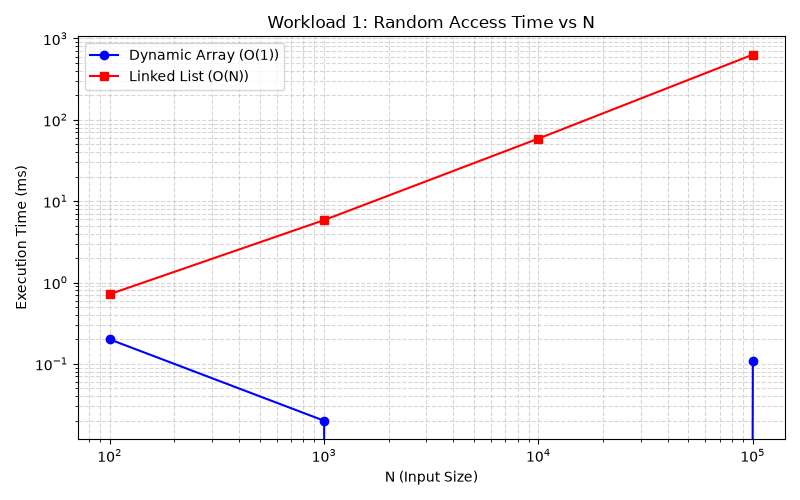
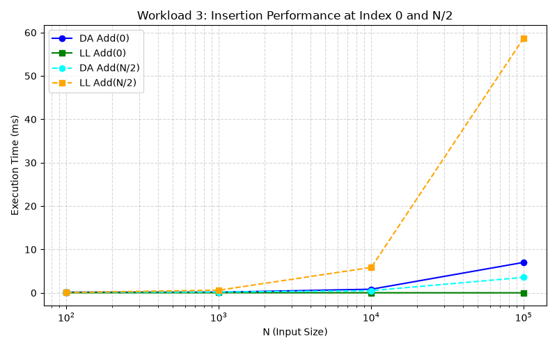
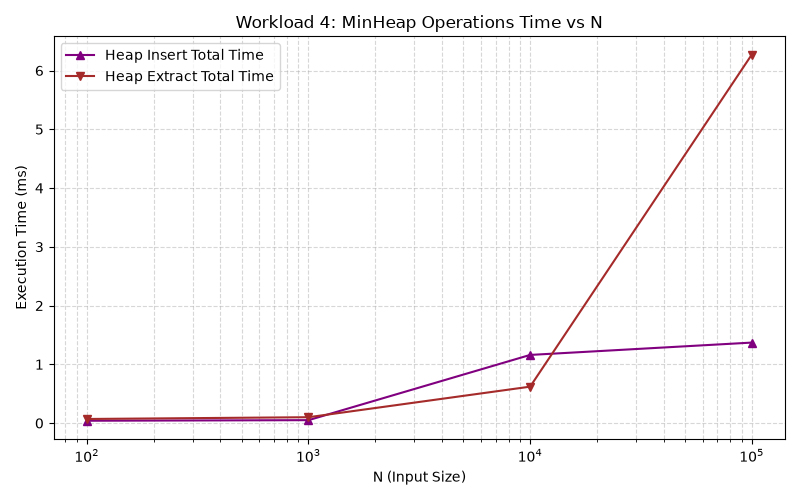

# Assignment 2: Algorithmic Analysis & Performance Trade-offs

## 1. Overview
This project contains custom implementations and empirical benchmarks for three fundamental data structures in Java:
1. **Dynamic Array**
2. **Singly Linked List**
3. **Min-Heap**

**Goal:** Compare theoretical time complexity ($\mathcal{O}, \Omega, \Theta$) with measured execution times across various dataset sizes ($N \in \{100, 1000, 10000, 100000\}$), and prove the correctness of core operations using loop invariants.

---

## 2. Complexity Analysis

| Structure | Operation | Best Case | Average Case | Worst Case | Auxiliary Space |
| :--- | :--- | :--- | :--- | :--- | :--- |
| **Dynamic Array** | `get(i)` | $\Theta(1)$ | $\Theta(1)$ | $\Theta(1)$ | $\Theta(1)$ |
| | `add(x)` | $\Theta(1)$ | $\Theta(1)$ (amortized) | $\Theta(n)$ | $\Theta(1)$ |
| | `add(i, x)` / `remove(i)` | $\Theta(1)$ (at end) | $\Theta(n)$ | $\Theta(n)$ | $\Theta(1)$ |
| | `contains(x)` | $\Theta(1)$ | $\Theta(n)$ | $\Theta(n)$ | $\Theta(1)$ |
| **Linked List** | `get(i)` | $\Theta(1)$ (index 0) | $\Theta(n)$ | $\Theta(n)$ | $\Theta(1)$ |
| | `add(i, x)` / `remove(i)` | $\Theta(1)$ (index 0) | $\Theta(n)$ | $\Theta(n)$ | $\Theta(1)$ |
| | `contains(x)` | $\Theta(1)$ | $\Theta(n)$ | $\Theta(n)$ | $\Theta(1)$ |
| **Min-Heap** | `insert(x)` | $\Theta(1)$ | $\mathcal{O}(\log n)$ | $\mathcal{O}(\log n)$ | $\Theta(1)$ |
| | `peekMin()` | $\Theta(1)$ | $\Theta(1)$ | $\Theta(1)$ | $\Theta(1)$ |
| | `extractMin()` | $\Theta(\log n)$ | $\Theta(\log n)$ | $\Theta(\log n)$ | $\Theta(1)$ |

### Short Justification:
* **Dynamic Array:** Provides direct random access `get(i)` in $\Theta(1)$ due to contiguous memory allocation. Insertions/deletions require $\Theta(n)$ due to element shifting (`System.arraycopy`).
* **Linked List:** Efficient head operations in $\Theta(1)$. Random access and middle insertions require $\Theta(n)$ node traversals.
* **Min-Heap:** Maintains the root as the minimum element (`heap[0]`). Structural adjustments (`siftUp`/`siftDown`) take logarithmic time $\mathcal{O}(\log n)$ based on tree height.

---

## 3. Algorithmic Correctness (Loop Invariants)

### 1. Linear Search (`DynamicArray.contains`)
* **Loop Invariant:** Prior to each iteration $i$, the target element `x` is not present in the subarray `data[0 .. i-1]`.
* **Initialization:** Before the loop starts ($i = 0$), `data[0 .. -1]` is empty. Thus, `x` is vacuously absent.
* **Maintenance:** If `data[i] == x`, the algorithm returns `true`. Otherwise, $i$ increments to $i+1$. Since `x` was not in `data[0 .. i-1]` and `data[i] != x`, it is absent in `data[0 .. i]`.
* **Termination:** The loop terminates when $i = \text{size}$. By invariant, `x` is absent from `data[0 .. size-1]`.
* **Correctness:** Returning `false` post-loop guarantees `x` does not exist in the array.

### 2. Heapify Down (`MinHeap.siftDown`)
* **Loop Invariant:** For node index $k$, both left and right subtrees independently satisfy the Min-Heap property.
* **Initialization:** At invocation ($k = 0$), subtrees rooted at $k$'s children are valid Min-Heaps.
* **Maintenance:** If `heap[k]` exceeds its smallest child, swapping them restores the heap property at position $k$, shifting any potential violation down one level.
* **Termination:** Stops when $k$ has no children or `heap[k] <= min(children)`.
* **Correctness:** Upon termination, the entire tree satisfies the Min-Heap invariant.

---

## 4. Experimental Setup
* **Dataset Sizes ($N$):** 100, 1,000, 10,000, 100,000.
* **Repetitions:** 5 runs per test case; reported figures show mean execution time.
* **Timer Method:** `System.nanoTime()` reported in milliseconds (`ms`).
* **Benchmarking Rules:** Inputs generated prior to timing using `Random(42 + run)` seed.

---

## 5. Benchmark Results

### Workload 1: Random Access (10,000 `get` operations)
| N | Dynamic Array Avg Time (ms) | Linked List Avg Time (ms) | Complexity (DA / LL) |
| :--- | :--- | :--- | :--- |
| **100** | 0.20 | 0.72 | $\Theta(1)$ / $\mathcal{O}(n)$ |
| **1,000** | 0.02 | 5.86 | $\Theta(1)$ / $\mathcal{O}(n)$ |
| **10,000** | 0.00 | 58.87 | $\Theta(1)$ / $\mathcal{O}(n)$ |
| **100,000** | 0.11 | 633.25 | $\Theta(1)$ / $\mathcal{O}(n)$ |

### Workload 2: Search (1,000 `contains` operations)
| N | Dynamic Array Avg Time (ms) | Linked List Avg Time (ms) | Complexity (DA / LL) |
| :--- | :--- | :--- | :--- |
| **100** | 0.71 | 0.61 | $\mathcal{O}(n)$ / $\mathcal{O}(n)$ |
| **1,000** | 1.84 | 1.48 | $\mathcal{O}(n)$ / $\mathcal{O}(n)$ |
| **10,000** | 18.44 | 16.04 | $\mathcal{O}(n)$ / $\mathcal{O}(n)$ |
| **100,000** | 173.46 | 150.14 | $\mathcal{O}(n)$ / $\mathcal{O}(n)$ |

### Workload 3: Insertions (1,000 operations)
| N | Add(0) DA (ms) | Add(0) LL (ms) | Add(N/2) DA (ms) | Add(N/2) LL (ms) |
| :--- | :--- | :--- | :--- | :--- |
| **100** | 0.15 | 0.04 | 0.16 | 0.09 |
| **1,000** | 0.15 | 0.04 | 0.19 | 0.61 |
| **10,000** | 0.83 | 0.02 | 0.50 | 5.86 |
| **100,000** | 7.02 | 0.00 | 3.57 | 58.73 |

### Workload 4: Priority Processing (MinHeap)
| N | Insert Total Time (ms) | Extract Total Time (ms) | Complexity (per op) |
| :--- | :--- | :--- | :--- |
| **100** | 0.04 | 0.07 | $\mathcal{O}(\log n)$ |
| **1,000** | 0.05 | 0.10 | $\mathcal{O}(\log n)$ |
| **10,000** | 1.16 | 0.62 | $\mathcal{O}(\log n)$ |
| **100,000** | 1.37 | 6.27 | $\mathcal{O}(\log n)$ |

---

## 6. Plots & Discussion

### Workload 1: Random Access

* **Discussion:** Dynamic Array exhibits steady O(1) performance, staying near zero execution time. Linked List scales linearly O(N), taking ~633 ms at N=100,000 due to pointer traversal overhead.

### Workload 3: Insertions

* **Discussion:** Linked List excels at `Add(0)` in O(1) time by updating pointer references. However, at index N/2, Linked List degrades significantly (O(N)) because it must traverse to the midpoint before inserting.

### Workload 4: Min-Heap Performance

* **Discussion:** Both `insert` and `extractMin` exhibit logarithmic scaling O(log N), processing 100,000 elements efficiently in milliseconds.

---

## 7. Performance & Design Analysis (Q&A)

1. **How does increasing N affect each workload?**
    - For linear operations (Linked List `get`, `contains`, `Add(N/2)`), execution time scales proportionally with N.
    - For logarithmic operations (Min-Heap), time increases subtly as tree depth grows ($\log_2 N$).
    - For O(1) operations (Dynamic Array `get`), execution time remains nearly flat regardless of N.

2. **Why do algorithms with the same Big-O complexity have different running times?**
    - Big-O ignores constant factors and low-level system optimizations. For example, linear search in Dynamic Array is faster than in Linked List due to CPU cache locality (contiguous memory blocks vs scattered pointers).

3. **How do constant factors and implementation details affect performance?**
    - Pointer dereferencing in Linked Lists creates cache misses. Dynamic Arrays benefit from contiguous memory layout, enabling continuous CPU prefetching.

---

## 8. Design Recommendations

1. **Use Dynamic Array when:** Frequent random access (`get(i)`) or appending elements at the end is required.
2. **Use Linked List when:** High-frequency insertions/deletions occur strictly at the head (`index = 0`).
3. **Use Min-Heap when:** Implementing Priority Queues or needing constant-time access to the minimum element with fast logarithmic updates.. **Use Min-Heap when:** Implementing Priority Queues or needing constant-time access to the minimum element with fast logarithmic updates.